# Sage.is AI-UI

An AI interface you run on your own hardware, with your own models, on your own terms.

[](https://github.com/Sage-is/AI-UI/releases)
[](https://github.com/Sage-is/AI-UI)
[](LICENSE)
[](https://discord.gg/3BtwHkXS)

Sage.is AI-UI is a chat and orchestration layer you run on your own infrastructure. It talks to any OpenAI-compatible provider (OpenAI, OpenRouter and others) plus Ollama.


<sub>The same interface on a phone: <a href="./app/static/screenshots/narrow-chat.png">narrow-chat.png</a>. Both are captured from a running instance by <code>scripts/capture_pwa_screenshots.mjs</code>, and both are what the browser shows in the install dialog.</sub>

##  Install

```bash
brew tap sage-is/apps && brew trust --tap sage-is/apps && brew install ai-ui
ai-ui start
```

Open [http://localhost:8080](http://localhost:8080) and create your admin account.

We are not in Homebrew's main catalogue yet, and Homebrew 6 asks you to trust third-party taps. Pass `--port 3000` if 8080 is taken.

Tap source: <https://github.com/Sage-is/homebrew-apps>.

##  Run from source

```bash
git clone https://github.com/Sage-is/AI-UI.git
cd AI-UI
make it_build_n_run
```

`make dev` runs everything live: Svelte HMR on `http://localhost:5173/` and Python reload.

##  Why

- **Your data stays put.** Conversations never leave the server you run Sage.is on. No telemetry on chat content, no exfiltration paths, no cloud dependency unless you graft one.
- **Bring your own models.** Works with any OpenAI-compatible provider (OpenAI, OpenRouter and others) plus Ollama. Mix providers per conversation if you want.
- **Teams work the way teams work.** Permissions, user groups, role-based access. Nothing exotic, nothing missing.
- **Plug things in.** Custom functions, RAG, code execution, image generation, voice. The pieces compose.

##  Features

- **Multi-model chat:** switch between models in the same chat, or talk to several at once.
- **Knowledge bases:** RAG-powered chats from PDFs, docs, websites, or Workshop Knowledge.
- **Privacy rules:** text bound for a hosted model is pseudonymized and the reply restored. Built-in detectors, admin rules, and a test bench. Panel at `/pages/admin/privacy`. ON by default for external connections from 3.2.0. Three switches turn it off.
- **Messaging bridges:** WhatsApp, Telegram, Signal, and email feed conversations and channels through Sage ([docs](./docs/bridges.md)).
- **Code execution:** built-in Python environment with custom function support.
- **Voice & video:** speech-to-text and text-to-speech for hands-free conversation.
- **Image generation:** DALL-E, ComfyUI, or AUTOMATIC1111.
- **Progressive web app:** offline-capable, installs like a native app.
- **Enterprise auth:** SSO, LDAP, audit logs.

##  Configure

Sage.is AI-UI runs with sensible defaults. Override with environment variables:

- `OPENAI_API_KEY` — Connect to OpenAI models
- `OLLAMA_BASE_URL` — Point to your Ollama instance
- `PRIVACY_KEY` — Key for privacy pseudonyms. Empty falls back to `WEBUI_SECRET_KEY`.

##  Docs

- [Documentation Index](./docs/README.md)
- [Messaging Bridges (WhatsApp, etc.)](./docs/bridges.md)
- [try.sage Trial Deployment](./docs/try-sage-deployment.md)
- [Product Stack](./docs/product-stack.md)
- [Development Workflow](./docs/development-workflow.md): Make targets, styling, scans
- [Community Hub Integration](./docs/community-hub.md)
- [Contributing](./docs/CONTRIBUTING.md)
- [Security](./docs/SECURITY.md)
- [Troubleshooting](./docs/troubleshooting.md)
- [Orientation](./docs/orientation.md)
- [Release Runbook](./docs/release-runbook.md)
- [Documentation Archive](./docs/archive/README.md)

##  Community

- **Discord:** [Join our community](https://discord.gg/3BtwHkXS)
- **Issues:** [Report bugs](https://github.com/Sage-is/AI-UI/issues)
- **Community Hub:** coming soon. community.sage.is is not yet public and `ENABLE_COMMUNITY_SHARING` stays off ([docs](./docs/community-hub.md)). Browse and share models, prompts, and tools across your Sage instances.

##  License

[GNU Affero General Public License v3](LICENSE)

Copyright (c) [year] [copyright holders]

Permission is hereby granted to any person obtaining a copy of this software and associated documentation files, to use, copy, modify, merge, publish, distribute, sublicense, and sell copies of the software, including for commercial purposes, subject to the following conditions:

If you distribute this software, or any work derived from it, you must release the complete source code under this same licence. If you modify this software and users interact with your version over a network — as a web application, an API, or a hosted service — you must offer those users the complete source code of your version, at no charge. All copies must include this copyright notice and this licence. You may not impose additional licence restrictions beyond this.

These permissions are irrevocable and royalty-free for the term of copyright. THE SOFTWARE IS PROVIDED "AS IS," WITHOUT WARRANTY OF ANY KIND. This is a plain-language summary. The full legal text of the GNU Affero General Public License, version 3, governs all use for you.

Sage.is Sprig Extensions built on the published [Sprig Spec](./docs/bonsai/sprig-spec-v1-draft.md) are not derivative works and may be authored under any license.

---

Built with [Startr.Style](https://startr.style) by [Sage.is](https://sage.is) (*part of [Startr](https://startr.cloud/)*) and contributors worldwide.
