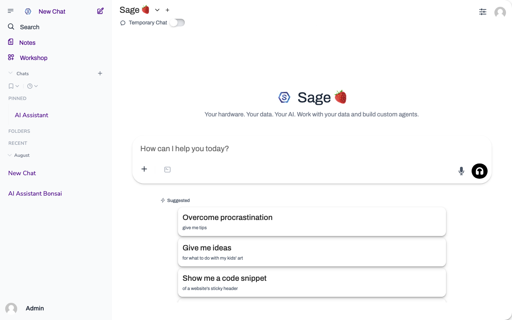

# Sage.is AI-UI

An AI interface you run on your own hardware, with your own models, on your own terms.

[](https://github.com/Sage-is/AI-UI/releases)
[](https://github.com/Sage-is/AI-UI)
[](LICENSE)
[](https://discord.gg/3BtwHkXS)

Sage.is AI-UI is a chat and orchestration layer that runs on your own infrastructure. It talks to whichever model providers you have available: any OpenAI-compatible provider (OpenAI, OpenRouter and others) plus Ollama.



<sub>The same interface on a phone: <a href="./app/static/screenshots/narrow-chat.png">narrow-chat.png</a>. Both are captured from a running instance by <code>scripts/capture_pwa_screenshots.mjs</code>, and both are what the browser shows in the install dialog.</sub>

## Why Sage.is AI-UI?

**Your data stays put.** Conversations never leave the server you run Sage.is on. No telemetry on chat content, no exfiltration paths, no cloud dependency unless you graft one.

**Bring your own models.** Sage.is works with any OpenAI-compatible provider (OpenAI, OpenRouter and others) plus Ollama. Mix providers per conversation if you want.

**Teams work the way teams work.** Permissions, user groups, role-based access. Nothing exotic; nothing missing.

**Plug things in.** Custom functions, RAG, code execution, image generation, voice. The pieces compose.

**Community Hub.** Coming soon. Browse and share models, prompts, tools, and knowledge across your Sage instances via [community.sage.is](https://community.sage.is). The site is not built yet, and `ENABLE_COMMUNITY_SHARING` stays off.

## Quick Start

### Using Make (Recommended)

```bash
git clone https://github.com/Sage-is/AI-UI.git
cd AI-UI
make it_build_n_run
```

Now open [http://localhost:8080](http://localhost:8080) and create your admin account.

`make dev` runs everything live: Svelte HMR on [http://localhost:5173/](http://localhost:5173/) and Python reload. `make it_build_n_run` builds and runs the baked image on port 8080 only.

## Available Make Commands

- `make it_run` — Start Sage.is AI-UI with Docker
- `make it_stop` — Stop running containers
- `make it_build` — Build Docker images
- `make it_clean` — Runs `docker system prune` and builder prune: system-wide, not only this project
- `make waha_start` — Start WAHA (WhatsApp bridge) locally
- `make waha_stop` — Stop WAHA container
- `make signal_start` — Start signal-cli-rest-api (Signal bridge) locally
- `make signal_stop` — Stop signal-cli-rest-api container
- `make help` — List the annotated targets
- `make help_all` — List every target
- `make dev` — Everything live: Svelte HMR on 5173, Python reload
- `make review` — The baked image, nothing mounted (`LIVE=1` mounts `pages/`, `REBUILD=1` rebuilds first)

## Core Features

- **Multi-model chat:** switch between models in the same chat, or talk to several at once.
- **Knowledge bases:** RAG-powered chats from PDFs, docs, websites, or Workshop Knowledge.
- **Privacy rules:** text bound for a hosted model is pseudonymized and the reply restored. Built-in detectors, admin rules, and a test bench. Panel at `/pages/admin/privacy`. ON by default for external connections from 3.2.0. Three switches turn it off.
- **Community Hub:** coming soon. community.sage.is is not built yet and `ENABLE_COMMUNITY_SHARING` stays off ([docs](./docs/community-hub.md)).
- **Messaging bridges:** WhatsApp, Telegram, Signal, and email feed conversations and channels through Sage ([docs](./docs/bridges.md)).
- **Code execution:** built-in Python environment with custom function support.
- **Voice & video:** speech-to-text and text-to-speech for hands-free conversation.
- **Image generation:** DALL-E, ComfyUI, or AUTOMATIC1111.
- **Progressive web app:** offline-capable, installs like a native app.
- **Enterprise auth:** SSO, LDAP, audit logs.

## Configuration

Sage.is AI-UI runs with sensible defaults. You can override:

**Environment Variables:**

- `OPENAI_API_KEY` — Connect to OpenAI models
- `OLLAMA_BASE_URL` — Point to your Ollama instance
- `PRIVACY_KEY` — Key for privacy pseudonyms. Empty falls back to `WEBUI_SECRET_KEY`.

## Styling

Sage.is AI-UI uses [Startr.Style](https://startr.style) — a utility-complete CSS framework under 50KB (8KB gzipped). Instead of class-based utilities, Startr.Style uses inline CSS custom properties for full access to the CSS spec with zero compilation:

```html
<div style="--d:flex; --ai:center; --g:1rem; --p:1rem; --br:0.5rem">
  <button style="--bg:var(--color-sky-500); --c:white; --hvr-bg:var(--color-sky-600)">
    Click me
  </button>
</div>
```

See [Startr.Style docs](https://startr.style) for the full property reference, responsive suffixes (`-sm`, `-md`, `-lg`, `-xl`), dark mode (`--dark-*`), and hover states (`--hvr-*`).

## CI/CD & Release Workflow

The Makefile IS the CI/CD framework. The same targets run on a developer laptop or a build server. Linux, macOS, and Windows (WSL) all work. GitHub Actions is not a dependency, but the targets compose with it if you want to call them from a hosted runner.

**Security scanning** (local-first — git hooks run the same targets, no CI service):

```bash
make install_dev          # Install gitleaks, semgrep, bandit, trivy + wire git hooks
make scan                 # Full audit: secrets (history), SAST, dependency CVEs
make scan_tree            # Fast private-data scan of the tracked tree (what pre-push runs)
```

After `install_dev`, every commit scans the staged diff and every push scans the tree — secrets plus internal hostnames, developer paths, and contact lists. Details: [docs/development-workflow.md](docs/development-workflow.md).

**Release process:**

```bash
make minor_release        # (or patch_release / major_release) — creates the release branch
make bump_release_version # Writes the version into app/package.json
# Write the ## [X.Y.Z] section in CHANGELOG.md
make ship                 # Runs preflight and the smoke test itself, then tags and pushes
```

`make ship` is the only way to publish, and it covers hotfixes too. The steps underneath it are private, so there is no second door to take by mistake. It gates on `release_smoke`, which refuses to run off a `release/*` or `hotfix/*` branch, on a dirty tree, or when `app/package.json` disagrees with the branch version.

Full runbook, including what to do when a step fails halfway: [docs/release-runbook.md](docs/release-runbook.md).

DB snapshots for upgrade testing live in `tools/db_snapshots/` (gitignored, synced via SyncThing). See `tools/db_snapshots/README.md` for details.

## Documentation

- [Documentation Index](./docs/README.md)
- [Messaging Bridges (WhatsApp, etc.)](./docs/bridges.md)
- [try.sage Trial Deployment](./docs/try-sage-deployment.md)
- [Product Stack](./docs/product-stack.md)
- [Development Workflow](./docs/development-workflow.md)
- [Community Hub Integration](./docs/community-hub.md)
- [Contributing](./docs/CONTRIBUTING.md)
- [Security](./docs/SECURITY.md)
- [Troubleshooting](./docs/troubleshooting.md)
- [Orientation](./docs/orientation.md)
- [Documentation Archive](./docs/archive/README.md)

## Community

- **Community Hub:** coming soon. community.sage.is is not built yet and `ENABLE_COMMUNITY_SHARING` stays off. You will be able to browse and share models, prompts, tools, and more, and deploy community items directly to your Sage instances.
- **Discord:** [Join our community](https://discord.gg/3BtwHkXS)
- **Issues:** [Report bugs](https://github.com/Sage-is/AI-UI/issues)

## License

[GNU Affero General Public License v3](LICENSE)

Sage.is AI-UI ships under AGPL-3.0. The choice is deliberate: this is a network service, and AGPL Section 13 closes the SaaS loophole that the plain GPL leaves open. If you modify Sage.is AI-UI and host the modified version for other users, you owe those users your source. If you run Sage.is AI-UI unmodified, AGPL imposes no extra obligation on you.

What that means in practice:

If you run unmodified Sage.is AI-UI as-is, you do not need to publish anything. The license stays as it is.

If you fork Sage.is AI-UI, change the code, and put the fork in front of users over a network, you must offer those users your source. Internal use without remote users does not trigger the source-disclosure obligation.

If you build a **Sprig™** against the published Sprig Spec™ contract (`docs/bonsai/sprig-spec-v1-draft.md`), your Sprig™ is not a derivative work of Sage.is AI-UI. The Sprig™ communicates across an arms-length process boundary using a published protocol — the same pattern that lets proprietary userspace run on a GPL'd Linux kernel without inheriting the kernel's license. Sprig™ authors choose their own license. Proprietary, MIT, Apache-2.0, AGPL, anything. See `docs/bonsai/` for the full license-compatibility section.

Standard AGPL freedoms apply: run, study, share, and modify. Standard warranty disclaimers and liability limits apply. Patent grants from contributors apply.

---

Built with [Startr.Style](https://startr.style) by [Sage.is](https://sage.is) (*part of [Startr](https://startr.cloud/)*) and contributors worldwide.
