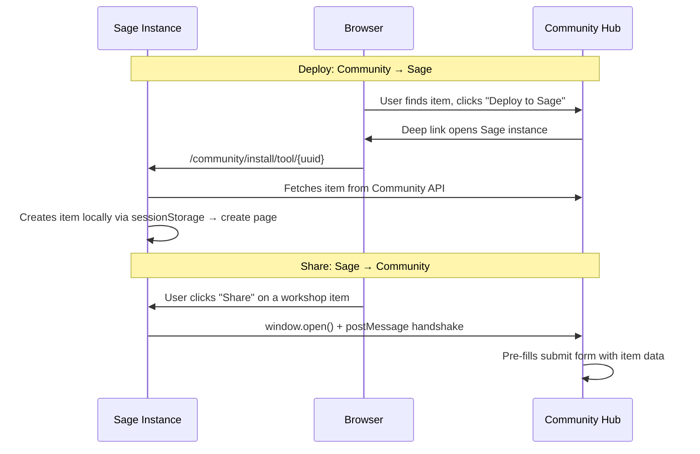
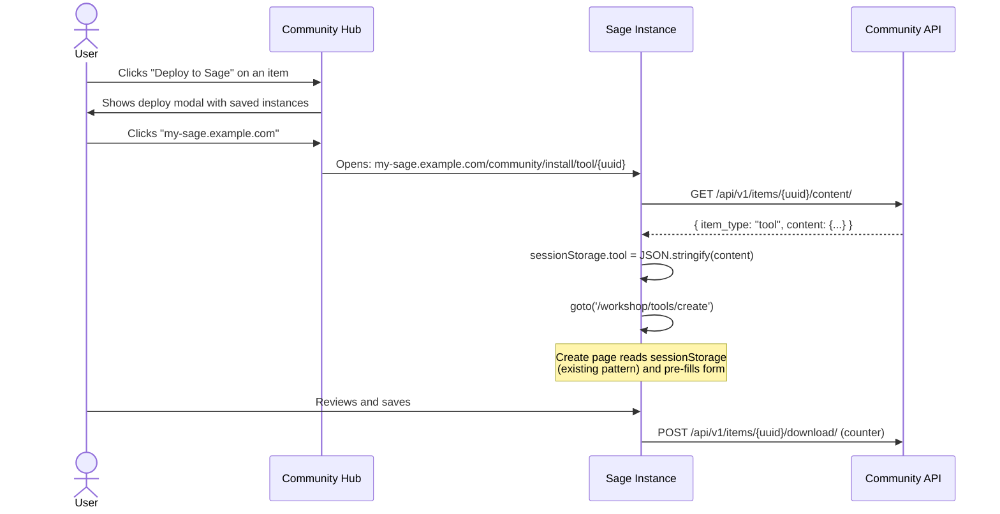
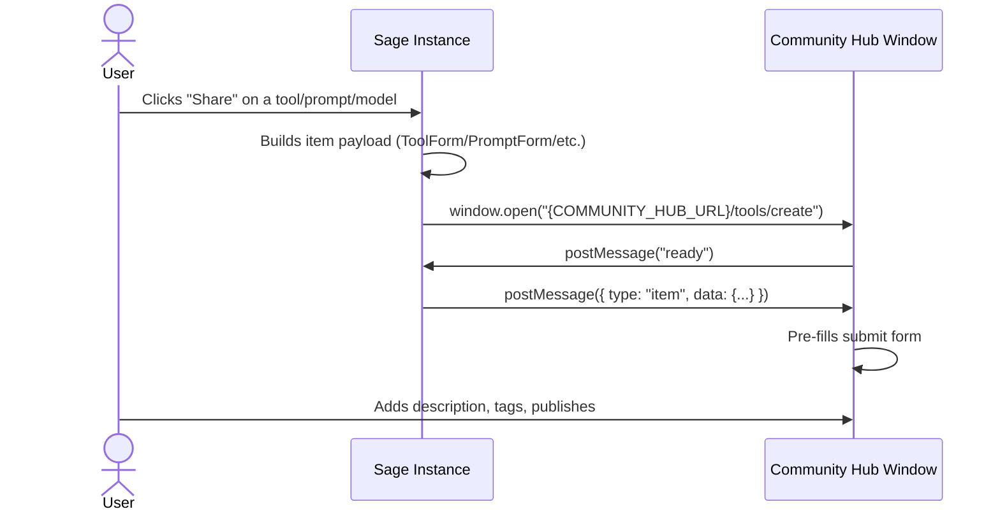

# Community Hub Integration

Sage WebUI integrates with the [Sage Community Hub](https://community.sage.is) to let users browse, share, and deploy workshop items (models, prompts, tools, functions, knowledge) across their Sage instances.

## Overview

The Community Hub is a separate Django application that serves as a public registry for shared workshop items. Sage instances communicate with it entirely through the user's browser — no server-to-server connections, no API keys, no shared auth.



## Configuration

### `COMMUNITY_HUB_URL`

The base URL of the Community Hub. Set via environment variable or backend config:

```bash
# .env
COMMUNITY_HUB_URL=https://community.sage.is
```

Default: `https://community.sage.is`

This URL is used by:
- The "Browse Community" button in the Workshop
- The `/community/install` route when fetching item content
- The share handler when opening the community hub window

### Feature Flag

Community sharing is controlled by the existing `enable_community_sharing` config flag in `config.py`. When disabled, the "Browse Community" and "Share" buttons are hidden.

## Deploy Flow (Community → Sage)

When a user deploys a community item to their Sage instance:



### The Install Route

**Path:** `(app)/community/install/[type]/[id]/+page.svelte`

This route:

1. **Validates** the `type` parameter against the mapping:

   | Type | Create Route | sessionStorage Key |
   |------|-------------|-------------------|
   | `tool` | `/workshop/tools/create` | `tool` |
   | `prompt` | `/workshop/prompts/create` | `prompt` |
   | `model` | `/workshop/models/create` | `model` |
   | `function` | `/admin/functions/create` | `function` |
   | `knowledge` | `/workshop/knowledge/create` | `knowledge` |

2. **Fetches** item content from `{COMMUNITY_HUB_URL}/api/v1/items/{id}/content/`
3. **Stores** the `content` field in `sessionStorage[key]` as JSON
4. **Redirects** to the appropriate create page
5. **Increments** the download counter (fire-and-forget POST)

The create pages already handle sessionStorage data — this is the same pattern used by the "Clone" and "Import" features.

## Instance Registration

When a user clicks "Browse Community" in the Workshop, Sage opens the community site with UTM parameters:

```
https://community.sage.is/tools/?utm_instance=https://my-sage.example.com&utm_sage_version=0.5.2
```

| Parameter | Source | Purpose |
|-----------|--------|---------|
| `utm_instance` | `window.location.origin` | Instance URL for registration |
| `utm_instance_name` | `WEBUI_NAME` or `document.title` | Display name |
| `utm_sage_version` | App version string | Version compatibility checking |

The Community Hub stores these in the user's browser (localStorage) and optionally on the server (if the user is logged in). This enables the "Deploy to Sage" modal to show the user's registered instances.

### Multi-Instance Support

Users with multiple Sage instances (local dev, production, staging) can deploy community items to any of them. Each time a different Sage instance opens the community site, it auto-registers via UTM parameters. The community site accumulates all instances and presents them in the deploy modal.

## Share Flow (Sage → Community)

When a user clicks "Share to Community" on a workshop item:



### Origin Whitelist

The create pages accept `postMessage` from these origins:

```typescript
const ALLOWED_ORIGINS = [
    'https://sage.is',
    'https://www.sage.is',
    'https://community.sage.is',
    'http://localhost:5173',
    'http://localhost:8000',
    'http://localhost:9999'
];
```

## Files Reference

### Sage WebUI files involved in community integration:

| File | Role |
|------|------|
| `app/src/routes/(app)/community/install/[type]/[id]/+page.svelte` | Install route (NEW) |
| `app/src/lib/constants.ts` | `COMMUNITY_HUB_URL` constant |
| `app/src/lib/components/workshop/Tools.svelte` | Share handler, "Browse Community" button |
| `app/src/lib/components/workshop/Prompts.svelte` | Share handler, "Browse Community" button |
| `app/src/lib/components/workshop/Models.svelte` | Share handler, "Browse Community" button |
| `app/src/routes/(app)/workshop/tools/create/+page.svelte` | Receives items via sessionStorage/postMessage |
| `app/src/routes/(app)/workshop/prompts/create/+page.svelte` | Same |
| `app/src/routes/(app)/workshop/models/create/+page.svelte` | Same |
| `app/src/routes/(app)/admin/functions/create/+page.svelte` | Same |
| `app/backend/open_webui/config.py` | `ENABLE_COMMUNITY_SHARING` flag |

### Community Hub (separate project):

- **Repository:** [WEB-Sage-Community-Hub](https://github.com/Sage-is/Community-Hub)
- **Architecture:** See `docs/ARCHITECTURE.md` in the Community Hub repo
- **API base:** `https://community.sage.is/api/v1/`
