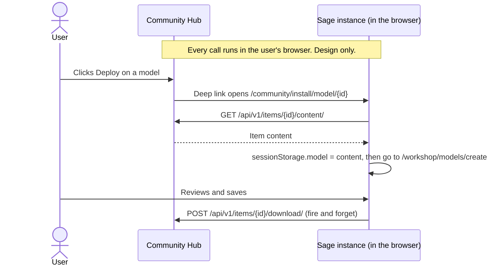

# Community Hub: winter plan

Updated 2026-10-04.

## Status

- community.sage.is is the planned sharing site for Sage.is instances (`TODO.md:211`). Coming this winter. No firmer date. No card sets which item types it carries yet; see the ships section.
- Sharing is off by default until launch. The ENABLE_COMMUNITY_SHARING env default is the string "False" `app/backend/sage_is_ai/config.py:1484-1492`.
- The off default is a mask, not a fix. Turning the flag on re-arms every broken handler below `TODO.md:214`.
- The off default does not reach instances that already saved the setting. A stored DB value beats the env default, and ENABLE_PERSISTENT_CONFIG defaults True `app/backend/sage_is_ai/config.py:157-158, 162-172` (line 168 checks the stored value first).
- Saving the admin General or Features page writes the flag to the DB `app/backend/sage_is_ai/routers/auths.py:1028-1029`; `app/backend/sage_is_ai/pages/features_panel.py:119-122`.
- No migration forces it off. An instance whose admin saved settings while the default was on still has sharing on.
- The hub app is not built. The local repo WEB-Sage-Community-Hub has no commits; it holds only README.md, .gitignore, .env.example and docs/ARCHITECTURE.md (`git log` in `../WEB-Sage-Community-Hub` reports no commits).
- Intended item types, from the previous version of this page (commit `228b958`, line 3): models, prompts, tools, functions, knowledge. Tools and functions do not ship at launch; knowledge is an open decision. See the ships section below.

## What exists today

### Flag

- main.py registers it and sends it to the browser as features.enable_community_sharing `app/backend/sage_is_ai/main.py:924, :1953`.
- The admin config API reads and writes it `app/backend/sage_is_ai/routers/auths.py:970, 1028-1029, 1053`.
- Jinja panels read it `app/backend/sage_is_ai/pages/features_panel.py:33`; `app/backend/sage_is_ai/pages/agents_panel.py:333-335`; `app/backend/sage_is_ai/pages/prompts_panel.py:258-260`.
- Svelte store plus admin General toggle `app/src/lib/stores/index.ts:304`; `app/src/lib/components/admin/Settings/General.svelte:336`.

### Gated share buttons

All five check the flag. Function and Feedbacks were gated 2026-08-15 per `TODO.md:214`.

- Model menu `app/src/lib/components/workshop/Models/ModelMenu.svelte:82`.
- Prompt menu `app/src/lib/components/workshop/Prompts/PromptMenu.svelte:43`.
- Function menu `app/src/lib/components/admin/Functions/FunctionMenu.svelte:77`.
- Share Chat modal `app/src/lib/components/chat/ShareChatModal.svelte:171`.
- Feedbacks `app/src/lib/components/admin/Evaluations/Feedbacks.svelte:392`.

### Gated discover links

These go to https://sage.is/community, the marketing site, not community.sage.is.

- `app/src/lib/components/workshop/Models.svelte:587, 595`; `app/src/lib/components/workshop/Prompts.svelte:337, 346`; `app/src/lib/components/admin/Functions.svelte:524, 532`.

### Share handlers

Real code, and none opens community.sage.is.

- Prompts send to https://sage.is/prompts/create `app/src/lib/components/workshop/Prompts.svelte:48-63`.
- Functions send to /functions/create `app/src/lib/components/admin/Functions.svelte:64-80`.
- Feedbacks send to /leaderboard `app/src/lib/components/admin/Evaluations/Feedbacks.svelte:124-141`.
- Share Chat sends to /chats/upload `app/src/lib/components/chat/ShareChatModal.svelte:35-55`.
- Models send to a public request-bin URL `app/src/lib/components/workshop/Models.svelte:102-125` (URL at :105).

### No-build (Jinja) pages

- Jinja agents and prompts pages show Share and community links only when the flag is on `app/backend/sage_is_ai/pages/templates/agents.html:155-156, 206-209`; `app/backend/sage_is_ai/pages/templates/prompts.html:108-109, 161-164`; routes `app/backend/sage_is_ai/pages/router.py:524, 626`.
- Their Share links send no data. Agents Share opens the community home page, and prompts Share opens a bare /prompts/create `app/backend/sage_is_ai/pages/agents_panel.py:336`; `app/backend/sage_is_ai/pages/prompts_panel.py:261-262`.

### Install side

- Create pages read sessionStorage, the same pattern as Clone and Import `app/src/routes/(app)/workshop/models/create/+page.svelte:92-95`; `app/src/routes/(app)/workshop/prompts/create/+page.svelte:59-63`; `app/src/routes/(app)/admin/functions/create/+page.svelte:80-83`.
- Clone writers `app/src/lib/components/workshop/Models.svelte:93`; `app/src/lib/components/workshop/Prompts.svelte:75`; `app/src/lib/components/admin/Functions.svelte:98`. Import writer `app/src/lib/components/admin/Functions.svelte:210-213`.
- Create pages also listen for postMessage and send 'loaded' to window.opener `app/src/routes/(app)/workshop/models/create/+page.svelte:70-90`; `app/src/routes/(app)/workshop/prompts/create/+page.svelte:36-57`; `app/src/routes/(app)/admin/functions/create/+page.svelte:64-78`.

### Permissions

- Any verified user with workshop.models, workshop.prompts or workshop.knowledge can create those items `app/backend/sage_is_ai/routers/models.py:63-71`; `app/backend/sage_is_ai/routers/prompts.py:66-73`; `app/backend/sage_is_ai/routers/knowledge.py:163-170`.
- All three default False `app/backend/sage_is_ai/config.py:1266-1277, 1399-1403`.

### Not built

- The install route /community/install/[type]/[id] has no app/src/routes/(app)/community directory.
- COMMUNITY_HUB_URL has no setting, env var or constant in app/. `app/src/lib/constants.ts` defines APP_NAME (:4), WEBUI_VERSION (:16) and instance-local base URLs (:6-14), but no hub URL.
- ALLOWED_ORIGINS constant: none, three inline lists instead.
- Instance registration (utm_instance, utm_sage_version): no code.
- Tools UI: no `app/src/lib/components/workshop/Tools.svelte` and no `app/src/routes/(app)/workshop/tools/create`.
- The knowledge create page has no sessionStorage or postMessage reader `app/src/routes/(app)/workshop/knowledge/create/+page.svelte`.

## What blocks turning sharing on

### Security

- [MANUALLY] Incident first: check whether the bin captured traffic; rotate anything a shared system prompt disclosed `TODO.md:216`.
- [WE] The leak is still in code. Each model Share click sent the full model record, params.system included, as a query string to a public request-bin URL. Scope: try.sage.is (3.0.0) and every deployed instance `app/src/lib/components/workshop/Models.svelte:105, 110-113`; `TODO.md:211-213, 219`.
- [WE] Dead size guard: :108 tests model.knowledge_base, a field ModelModel lacks, so the query-string branch always runs `app/src/lib/components/workshop/Models.svelte:108`; `app/backend/sage_is_ai/models/models.py:102-115`; `TODO.md:218`.
- No board card yet: even if the large-model branch ran, its postMessage could never fire. :118 compares event.origin (scheme and host only) with the :105 URL, which has a path `app/src/lib/components/workshop/Models.svelte:105, 118, 120`. Today the branch is unreachable anyway because of the dead guard above.
- No board card yet: the saved-on flag survives on existing instances, and there is no migration `app/backend/sage_is_ai/config.py:162-172`.
- No board card yet: every share handler posts with targetOrigin '*' `app/src/lib/components/workshop/Models.svelte:120`; `app/src/lib/components/workshop/Prompts.svelte:59`; `app/src/lib/components/chat/ShareChatModal.svelte:49-55`; `app/src/lib/components/admin/Functions.svelte:80`; `app/src/lib/components/admin/Evaluations/Feedbacks.svelte:141`.
- No board card yet: install listeners trust any message from an allowlisted origin, skip a window.opener check, and JSON.parse it into the form; the functions form holds code the server runs `app/src/routes/(app)/workshop/models/create/+page.svelte:70-86`; `app/src/routes/(app)/workshop/prompts/create/+page.svelte:36-52`; `app/src/routes/(app)/admin/functions/create/+page.svelte:64-74`.
- No board card yet: install receivers ignore the flag. They always listen and always send 'loaded' `app/src/routes/(app)/workshop/models/create/+page.svelte:70-90`; `app/src/routes/(app)/workshop/prompts/create/+page.svelte:36-57`; `app/src/routes/(app)/admin/functions/create/+page.svelte:64-78`.
- [WE] Function and tool share types are unsafe `TODO.md:225-227` (details in the ships section).
- [WE] The execute event runs server-supplied code through new Function in the top frame `app/src/lib/components/chat/Chat.svelte:387`; card `TODO.md:247` picks neuter-in-place `TODO.md:252`; CSP without unsafe-eval closes the browser half `TODO.md:242-243`; the POST /functions/load/url side is still open `TODO.md:564-566`; a listing policy is not the control `charts/sprig-creator-program/TODO.md:61`.
- [WE] No CSP by default. SecurityHeadersMiddleware sends one only if CONTENT_SECURITY_POLICY is set; it is unset in .env.example, Dockerfile, docker-compose.yaml, distribution.env; diagnostics reports csp_missing `app/backend/sage_is_ai/main.py:1443`; `app/backend/sage_is_ai/utils/security_headers.py:39-58, 188-190`; `app/backend/sage_is_ai/routers/diagnostics.py:601-621`; gate card `TODO.md:233`; policy card `TODO.md:242` (omit unsafe-eval, report-only first); marketplace blocker `TODO.md:568`.
- [WE] No provenance (source/origin) field, so a bad item cannot be listed and revoked `TODO.md:228`.
- No board card yet: install is not admin-only for model, prompt, knowledge; a facilitator can grant those permissions to a group with no admin in it `app/backend/sage_is_ai/routers/groups.py:109-126`; `app/backend/sage_is_ai/utils/facilitator.py:34-38`; `charts/sprig-creator-program/TODO.md:34`.
- No board card yet: base-model shadowing deletes models; bulk import skips review and POST /sync deletes missing functions; prompt commands are a global first-come namespace and install hardcodes access_control: null `charts/sprig-creator-program/TODO.md:36-38`.
- No board card yet: CORS_ALLOW_ORIGIN defaults '*'; the UTM registration scheme would send every instance's hostname and version to a public site `charts/sprig-creator-program/TODO.md:39`; the previous version of this page (commit `228b958`, lines 101-117).
- No board card yet: two `By <author>` links ignore the flag and point to `https://sage.is/m/<username>` `app/src/lib/components/chat/ChatPlaceholder.svelte:115-116`; `app/src/lib/components/chat/Placeholder.svelte:200-202`.

### Wiring

- [WE] No COMMUNITY_HUB_URL. Hardcoded https://sage.is: 10 in share and browse paths, 3 https://sage.is plus 3 https://www.sage.is in install allowlists, 2 in author links. Board says ~9 `TODO.md:220`.
  - Share and browse: `Models.svelte:595`; `Prompts.svelte:51, 346`; `Functions.svelte:72, 532`; `ShareChatModal.svelte:40`; `Feedbacks.svelte:134`; `agents_panel.py:336`; `prompts_panel.py:261, 262`.
  - Install: `models/create/+page.svelte:72`; `prompts/create/+page.svelte:38`; `functions/create/+page.svelte:66`. Author links: `ChatPlaceholder.svelte:116`; `Placeholder.svelte:202`.
- [WE] Destination pages on sage.is: four of five soft-404, so Share toasts success and does nothing `TODO.md:222`.
- [WE] Handshake word: code uses 'loaded' everywhere, and the previous version of this page (commit `228b958`, line 132) said 'ready' `TODO.md:223`.
- [WE] Allowlists disagree: models and prompts allow sage.is, www.sage.is, localhost:5173; functions allows localhost:9999; none allows https://community.sage.is `TODO.md:224`; `app/src/routes/(app)/workshop/models/create/+page.svelte:72`; `app/src/routes/(app)/workshop/prompts/create/+page.svelte:38`; `app/src/routes/(app)/admin/functions/create/+page.svelte:66`.
- No board card yet: Jinja Share links send no data `app/backend/sage_is_ai/pages/agents_panel.py:336`; `app/backend/sage_is_ai/pages/prompts_panel.py:261-262`.
- No board card yet: install route, knowledge receiver, hub app.

### Housekeeping

- Stale board citations: `TODO.md:214` cites `app/backend/sage_is_ai/config.py:1471` (now 1484); `TODO.md:235, 569` cite `app/backend/sage_is_ai/main.py:1473` (now 1443); `TODO.md:236, 570` cite `app/backend/sage_is_ai/routers/diagnostics.py:610` (now 601-621); `TODO.md:576` cites `app/src/lib/components/chat/Chat.svelte:417` (now 419). `charts/sprig-creator-program/TODO.md:29, :47` carry the same stale cites (Chat.svelte 417→419, main.py 1473→1443, diagnostics.py 610→601-621, config.py 1471→1484).
- Ambiguous, not stale: `TODO.md:217` cites a bare `Models.svelte:105`. The line is still correct, but three files share the name; use `app/src/lib/components/workshop/Models.svelte:105`.
- Timeline drift: card says '~2 weeks out' (`TODO.md:211`, written 2026-08-15); the flag's code comment says '~2 weeks out' (`app/backend/sage_is_ai/config.py:1488`); the CSP card says 'opens in weeks' (`TODO.md:237`); chart says 'in the coming weeks' (`charts/sprig-creator-program/TODO.md:43`); README now says 'coming this winter' (`README.md:87`). The first four need rewording to 'this winter'.
- Docs disagree on this page: `docs/bonsai/sprig-creator-program.md:115` says ignore it; `README.md:76, 87` and `docs/README.md:31` link it; `docs/docs-drift-plan.md:34` cites `TODO.md:191/195`, now 220/224, and `README.md:75`, now 76.

## What ships first, and what never ships

### Candidates for the first release (no card sets scope)

- Model and prompt are the only types that have working receivers and are allowed at launch. Function also has a receiver (`app/src/routes/(app)/admin/functions/create/+page.svelte:64-83`), but `TODO.md:225` keeps it out at launch. No card picks the launch types; `TODO.md:225` only rules out function and tool. Chat and feedback shares depend on `TODO.md:222` and open decision 7.
- Knowledge: no receiver is built and no board card holds it. Whether it ships at launch is open decision 12.
- No card sets community-hub submission scope or its trust boundary. The marketplace slice (`TODO.md:558-559`) is a separate system. See open decision 5.

### Never at launch

- Function: unsandboxed RCE, exec server-side and new Function browser-side `TODO.md:226`.
- Tool: a shared tool with auth_type "session" sends each caller's JWT to the publisher `TODO.md:227`; `charts/sprig-creator-program/TODO.md:35`.
- `README.md:87` still advertises tools, and the previous version of this page (commit `228b958`, line 3) advertised tools and functions. Fix the README: drop tools from :87.

The board rule says "at launch" `TODO.md:225`. Whether that becomes permanent is an open decision.

## Install flow (design, not built)

Nothing in this section exists yet, and no board card holds it: not the install route, the exact-origin postMessage or multi-instance support (open decision 6). It records the previous page's intent, not a plan. Only COMMUNITY_HUB_URL (`TODO.md:220`) and the allowlist reconcile (`TODO.md:224`) have cards.

Nothing in this section exists yet. It records the intended design.

- Principle kept from the previous version of this page (commit `228b958`, line 9): all traffic goes through the user's browser. No server-to-server calls, no API keys, no shared auth. The browser still makes outbound calls, so zero-egress Rootstocks keep sharing off `app/backend/sage_is_ai/pages/agents_panel.py:329-332`; `app/backend/sage_is_ai/pages/prompts_panel.py:255-257`.
- Steps, from the previous version of this page (commit `228b958`, lines 54-74 and 80-95): user clicks Deploy on the hub; deep link opens /community/install/{type}/{id}; the browser fetches GET {hub}/api/v1/items/{id}/content/; content goes to sessionStorage[type]; redirect to the existing create page; a person reviews and saves (nothing auto-installs); fire-and-forget POST {hub}/api/v1/items/{id}/download/ counter. Hub endpoints exist on paper only `../WEB-Sage-Community-Hub/docs/ARCHITECTURE.md:451, :466`.
- Share direction intent: open the hub page, wait for the child's signal, post a typed envelope { type: "item", data } to the hub's exact origin, never '*'. One handshake word.
- One shared allowlist constant that includes https://community.sage.is, read from COMMUNITY_HUB_URL.
- Multi-instance (one hub account, many instances, deploy modal lists them) is intent only. It sends each instance's origin to the hub. Source: the previous version of this page (commit `228b958`, lines 115-117).

| Type | Create route | sessionStorage key |
|------|--------------|--------------------|
| prompt | /workshop/prompts/create | prompt |
| model | /workshop/models/create | model |
| knowledge | /workshop/knowledge/create | knowledge (receiver not built) |

```mermaid
sequenceDiagram
    actor U as User
    participant H as Community Hub
    participant S as Sage instance (in the browser)

    Note over H,S: Every call runs in the user's browser. Design only.
    U->>H: Clicks Deploy on a model
    H->>S: Deep link opens /community/install/model/{id}
    S->>H: GET /api/v1/items/{id}/content/
    H-->>S: Item content
    S->>S: sessionStorage.model = content, then go to /workshop/models/create
    U->>S: Reviews and saves
    S->>H: POST /api/v1/items/{id}/download/ (fire and forget)
```

## Open decisions

1. Who runs the incident check and what gets rotated? [MANUALLY]
2. Existing instances with a saved-on flag: migrate it off, or tell admins?
3. Function and tool: "not at launch" or "never"?
4. POST /functions/load/url (`TODO.md:564`) is already admin-only (`app/backend/sage_is_ai/routers/functions.py:82`). Should it get a further gate, such as an off switch or a source allowlist, or do we accept the admin-only risk in writing? (`TODO.md:566`)
5. Who may install: admin only, or keep workshop permissions and facilitator grants?
6. Instance registration: send origin and version to the hub, or not?
7. sage.is destinations (/chats/upload, /leaderboard and the rest): build or drop?
8. Default for COMMUNITY_HUB_URL (a PersistentConfig per `TODO.md:220`): `https://community.sage.is`?
9. Handshake word: 'loaded' or 'ready'?
10. CSP: report-only now, then enforce before launch or after?
11. This page: keep it as the winter plan, and update `docs/bonsai/sprig-creator-program.md:115` and `docs/docs-drift-plan.md:34` to match?
12. Knowledge sharing, metadata only (hub design `../WEB-Sage-Community-Hub/docs/ARCHITECTURE.md:372`): add a receiver card and ship it at launch, or leave it out? No board card yet.
