# Product Stack Diagram

AI-UI is one FastAPI backend, `sage_is_ai`, that serves two front ends: a SvelteKit single-page app and a set of server-rendered pages under /pages. This page maps each part, from the browser to the deploy, and marks the parts that are optional.

```mermaid
graph TD
  subgraph Client["Client"]
    Browser["User browser"]
  end

  subgraph Front["Front end"]
    SPA["SvelteKit SPA (static build, no SSR)"]
    Styling["startr.style + Tailwind v4"]
    Hollow["Hollowed routes: /home, /calendar"]
    Pages["Server-rendered pages at /pages (Jinja2)"]
    Swap["Startr Swap, htmx on 4 pages"]
  end

  subgraph Back["Backend: sage_is_ai on FastAPI"]
    Uvicorn["uvicorn (1 worker by default)"]
    API["FastAPI app: 32 routers"]
    Auth["Auth: JWT, API keys, OAuth, LDAP, magic links"]
    Config["PersistentConfig (283 admin settings)"]
    Privacy["Privacy filter (on by default for hosted chat models)"]
    Spaces["Spaces, renamed Channels (optional)"]
    Realtime["Socket.IO at /ws"]
    Lifespan["Lifespan: in-process background tasks"]
  end

  subgraph Data["Data"]
    SQLite[("SQLite: webui.db")]
    Alembic["Alembic migrations (20)"]
    Files[("Local files: UPLOAD_DIR")]
    Chroma[("Chroma vectors (optional Sprig)")]
    Redis[("Redis (optional)")]
  end

  subgraph AI["AI and Sprigs"]
    Connections["Model connections: Ollama, OpenAI-compatible"]
    Agents["Agents (rows in the model table)"]
    Supervisor["SprigSupervisor: 21-entry catalogue"]
    Embed["Embedding sprigs (optional)"]
    Rerank["Reranker sprig (optional)"]
    STT["Whisper speech-to-text sprig (optional)"]
    OtherSprigs["Loaders, Tika, Docling, ffmpeg, themes (optional)"]
  end

  subgraph Edges["Edges: bridges, tool servers, deploy"]
    Bridges["Chat bridges: WhatsApp, Signal, Telegram, Email (optional)"]
    Tools["OpenAPI tool servers (none by default)"]
    Trellis["Trellis CRM as @crm (optional, wired per instance)"]
    Image["ghcr.io/sage-is/ai-ui:3.2.0"]
    Deploy["make deploy + cr-deploy"]
    Instances["try.sage.is canary, then sage.startr.cloud"]
    CLI["ai-ui CLI: colima, Docker Desktop or OrbStack on macOS, Docker Engine on Linux"]
  end

  Browser --> SPA
  Browser --> Pages
  SPA --- Styling
  Pages --- Swap
  SPA --> Hollow
  Hollow -->|"pageHost.ts fetch"| Pages
  SPA -->|"REST, SSE"| API
  SPA <-->|"WebSocket"| Realtime
  Pages -->|"pages_router, token cookie"| API
  Uvicorn --> API
  API --> Auth
  API --> Config
  API --> Spaces
  API --> Privacy
  API --> Lifespan
  API -->|"SQLAlchemy"| SQLite
  Alembic -->|"migrates"| SQLite
  Config --> SQLite
  API --> Files
  Config -.-> Redis
  Realtime -.-> Redis
  Privacy -->|"OpenAI-compatible, not marked local"| Connections
  API -->|"Ollama, pipes, local"| Connections
  Agents -->|"base model"| Connections
  Lifespan --> Supervisor
  Supervisor -.-> Embed
  Supervisor -.-> Rerank
  Supervisor -.-> Chroma
  Supervisor -.-> STT
  Supervisor -.-> OtherSprigs
  Lifespan -.-> Bridges
  API --> Tools
  Tools -.-> Trellis
  Image --> Deploy
  Deploy -->|"image@digest"| Instances
  CLI -->|"runs locally"| Image
```

## Client

- The browser loads the SvelteKit SPA from / and the server-rendered pages from /pages.
- It talks to the backend over REST, SSE and a Socket.IO WebSocket at /ws/socket.io.
- The pages sign in with the same `token` cookie the API reads.
- Two optional Sprigs ship browser-side code: browser-ml, which Kokoro voice output needs, and code-pyodide, which runs Python in the browser.

## Front end

- The SPA is SvelteKit ~2.20 on Svelte 4.2.19, built with adapter-static and no server rendering. It has 312 .svelte files and 38 routes.
- startr.style inline props style 257 of the 312 files. Tailwind v4 utility classes still appear in about 90, most of them next to startr.style. Every page loads /themes/active.css. The sheet stays empty until a theme Sprig is grafted, and the Sprig fills it.
- The /pages layer is Jinja2: 19 panels, 21 templates and 57 routes, with assets cache-busted by content hash. Startr Swap swaps links and forms in place on every page. Only 4 pages load htmx.
- /home, /calendar and /settings/calendar keep the SPA chrome and show /pages content through pageHost.ts. The setup wizard shows the /pages/admin/setup/* panels.
- Five surfaces still run twice: sprigs, diagnostics, branding, agents and prompts. A Cypress parity gate compares the two versions.

## Backend

- FastAPI 0.115.7 runs on uvicorn 0.35.0, one worker by default. main.py mounts 32 routers, Socket.IO at /ws, the static assets and the SPA at /.
- Auth covers HS256 JWTs signed with WEBUI_SECRET_KEY, bcrypt passwords, `sk-` API keys, OAuth (Google, Microsoft, GitHub, OIDC), LDAP, a trusted email header and magic links.
- Admin-editable settings are PersistentConfig, 283 of them. An env var sets the default, and a value saved in the database wins unless ENABLE_PERSISTENT_CONFIG=False. Boot settings such as DATABASE_URL, REDIS_URL, WEBUI_SECRET_KEY, UVICORN_WORKERS and ENABLE_TRY_SAGE are plain env vars that the database cannot override.
- For chat completions (chat, tasks, Spaces and bridges), the privacy filter swaps emails, phone numbers and Canadian postal codes for same-shape fakes before the text reaches a hosted model, and swaps them back in the reply. Card numbers are redacted one way. Embedding, image and speech calls do not go through it. Neither do the raw proxy routes: /openai/chat/completions, the deprecated /openai/{path} catch-all, and the /ollama chat routes.
- By default the filter covers OpenAI-compatible connections that are not marked local. Ollama and Function pipe models skip it, wherever the Ollama host runs. An arena model follows the rule of the model it picks. An admin can turn it on or off per model or per connection, at /pages/admin/privacy.
- Chat replies stream over Socket.IO, or over SSE when there is no socket session. Background work runs as in-process asyncio tasks, with no job queue. Spaces are the renamed Open WebUI Channels. ENABLE_SPACES=False (the default) hides them in the sidebar, but the /api/v1/spaces router stays mounted and does not check the flag.

## Data

- SQLAlchemy 2.0.38 talks to the database, and Alembic 1.14.0 migrates it (20 revisions).
- The database is SQLite at `{DATA_DIR}/webui.db`, and only SQLite works in practice. A non-SQLite URL raises an error at import. There is no psycopg and no pgvector.
- Peewee only runs the 19 legacy migrations before Alembic. No models use it.
- Files go to local disk at UPLOAD_DIR. There is no S3, GCS or Azure provider.
- Redis is optional, and REDIS_URL is empty by default. When set, it syncs config across instances, relays task stops and can run the Socket.IO manager.

## AI and Sprigs

- Models come from Ollama and OpenAI-compatible connections, any number of each, plus Function pipe models and arena models. Users can add Direct Connections. Agents are rows in the `model` table on top of a base model.
- The Sprig catalogue has 21 entries over 16 capabilities. Nineteen are sha256-pinned OCI artifacts pulled from SPRIG_REGISTRY (default ghcr.io/sage-is) for arm64 and amd64. Two, mock-embedding and calendar, ship in the image.
- Nine entries (the embedding, reranker, whisper, Tika and Docling cultivars) run a loopback child process and point the matching setting at it. Eleven 'deliver' entries extract files into place, and calendar runs nothing.
- Optional Sprigs supply embeddings (three models in four cultivars: MiniLM, multilingual-e5-large as ONNX and GGUF, and bge-large, plus a test mock), a reranker, the Chroma vector store and whisper speech-to-text. Others add document loaders, Tika, Docling, ffmpeg, rclone backup and themes.
- Chroma is the default vector store and the only one with an install path. Adapters for Elasticsearch, Milvus, OpenSearch, Pinecone and Qdrant exist, but their client packages are not installed.
- Document extraction defaults to the langchain loaders, which ship in the optional rag-loaders Sprig. Until it is grafted, document processing fails. The upload is stored, but it comes back with an error that names the Sprig: the file record carries `error` on /api/v1/files/, and /process/file and Knowledge add answer 400. Tika and Docling uploads go through the same check.
- Web search providers are gone. Only URL-fetch loaders remain (safe_web by default, plus playwright, firecrawl, tavily and external), and they also need rag-loaders and a restart.

## Edges

- Chat bridges reach WhatsApp (through a WAHA sidecar), Signal (through a signal-cli-rest-api sidecar), Telegram and Email. They are off by default (ENABLE_BRIDGES=False).
- Tool servers are OpenAPI only. Admins set the shared ones in TOOL_SERVER_CONNECTIONS. An admin can also add personal tool servers in Settings → Tools, and so can a user once USER_PERMISSIONS_FEATURES_DIRECT_TOOL_SERVERS is on (off by default); the browser calls those itself. Custom Python tools are gone, and there is no MCP client or server. Trellis, the CRM, is a separate product an admin can plug in this way, with a static Bearer token and an agent named crm, so users reach it as @crm. AI-UI ships no Trellis wiring; each instance sets it up by hand.
- The image is ghcr.io/sage-is/ai-ui at 3.2.0. `make deploy` resolves the tag to its multi-arch digest and runs `cr-deploy`. It deploys try.sage.is first as the canary, backs up and deploys sage.startr.cloud next, and stops at the first failure.
- The `ai-ui` CLI, installed by Homebrew, runs the image locally. On a Mac it uses colima (the default), Docker Desktop or OrbStack; on Linux it uses Docker Engine. `ai-ui try` boots a local try.sage trial.
- Analytics (Matomo, Google Analytics 4 or Plausible) stays off until configured. The try.sage demo mode stays off unless ENABLE_TRY_SAGE=True.

## Coming this winter

- A community hub for sharing is coming this winter.
- Sharing is off by default (ENABLE_COMMUNITY_SHARING=False).
